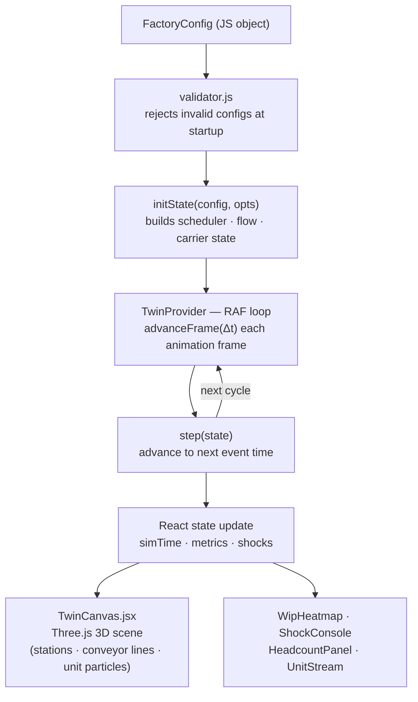
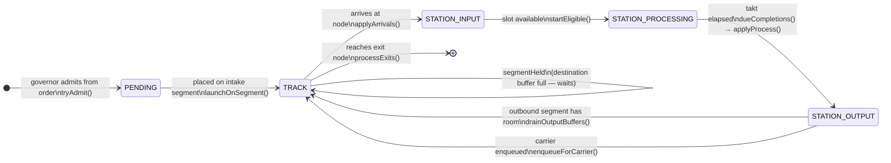

# Architecture Overview

This document is a code-linked map of the system. For the full design rationale, domain model, and binding decisions see [docs/designs/factory-twin-v2-architecture.md](designs/factory-twin-v2-architecture.md).

---

## Two Modes in One Codebase

`src/main.jsx` routes to one of two experiences:

| Route | Component | Status |
|-------|-----------|--------|
| `/` | `src/twin/ui/TwinApp.jsx` | **Active** — deterministic event-driven engine |
| `/legacy` | `src/App.jsx` | Reference only — M800-specific 3D prototype |

Only the deterministic twin (`/`) is actively developed.

---

## Implementation Status

| Phase | Scope | Status |
|-------|-------|--------|
| 0–6C | Domain types, network objects, engine core (flow, scheduler, processApply, WIP governance) | ✅ Complete |
| A | Carrier transport physics — FIFO pickup queue, round-trip, shift gating | ✅ Complete |
| B | Deadlock detection — circular-wait graph, `shock_raised` events | ✅ Complete |
| C | Aggregator metrics — `peopleRequired`, `amrFleet`, utilization, buffer fullness | ✅ Complete |
| D | UI integration — TwinCanvas, SimControls, WipHeatmap, HeadcountPanel, ShockConsole, ProcessForm | 🔄 In progress |
| E | TrackEditor, CarrierPoolPanel, ForkPanel, SchemaMatrixPanel | ⏳ Deferred |

> 200+ unit tests are green for phases 0–C. The engine public surface is frozen; only UI (Phase D) imports it.

---

## Deterministic Twin — Data Flow



---

## step() Tick — Execution Order

Each `step()` call jumps to the earliest pending event time (`min(tSched, tFlow, tCarrier)`) then runs six phases in order:

| # | Phase | Key functions |
|---|-------|--------------|
| 1 | **Arrivals** | `applyArrivals()` — segment arrivals land in station input buffers; overflow goes to `segmentHeld` |
| 2 | **Carrier events** | `processCarrierReturns()`, `processCarrierDrops()`, `dispatchCarriers()` |
| 3 | **Completions** | `dueCompletions()` — takt-expired slots run `applyProcess()`, result unit is routed outward |
| 4 | **Exits** | `procesExits()` — units at exit nodes are consumed; order counters updated; WIP decremented |
| 5 | **Admit** | `admitUnits()` — release governor spawns units from pending orders (if WIP cap allows) |
| 6 | **Start eligible** | `startEligible()` — fills free slots from station input buffers |
| Flush | **Retry blocked** | `tryFlushHeld()`, `drainOutputBuffers()` — retry moves that were blocked earlier this tick |

If `t === Infinity` with active orders remaining, `detectDeadlock()` runs and may emit a `shock_raised` event.

---

## Unit Lifecycle

A unit is a single physical item flowing through the network. Six location states track its progress:



**Scrap path:** an `inspect` process with `pass_rate < 1` routes the failing unit to a `scrap` exit node instead of the normal outbound path.

**Assembly (`N → 1`):** component units arrive at the assembly station and wait. When a complete kit is in the buffer (`checkAssemblyKit()`), they are consumed and a *new* product unit is born at that station. The components cease to exist; the product inherits enrichments if `enrichment_inherit = "union"`.

---

## Release Governor — WIP Cap

`releaseGovernor.js` is the pull mechanism. It controls when units are born from pending orders.

**Algorithm** (`tryAdmit`):

1. Derive the WIP cap: `cap = bottleneck.parallel_slots + bottleneck.entry_buffer_capacity`. Falls back to `10` if no stations are configured.
2. If `govState.wipCount >= cap` → return null (no admission this tick).
3. Otherwise, find the first arrived, non-completed order that still needs units and create the next unit.
4. `wipCount` increments on admission; decrements when a unit exits.

**Why `slots + buffer`?** The bottleneck's slots hold in-process WIP; its entry buffer holds units queued for the next slot. Admitting beyond this sum floods the network upstream of the bottleneck without increasing throughput — the queue simply grows further back.

**Product orders skip intake.** Orders whose `process_sequence[0]` is an `assembly` kind and whose `material_type` matches the assembly's `output_material` are skipped by `tryAdmit`. Those product units are born at the assembly station when a complete kit is ready, not at an intake node.

---

## Derived Formulas Reference (`src/twin/engine/derive.js`)

All derived values live here — never stored on entities, never hand-entered. The engine, validator, and aggregator import these pure functions.

| Function | Formula | Notes |
|----------|---------|-------|
| `effectiveSlots(parallelSlots, opsPerSlot, assignedOps)` | `min(parallelSlots, ⌊assignedOps / opsPerSlot⌋)` | `opsPerSlot = 0` → fully automated; returns all `parallelSlots` |
| `capacityPerHour(taktSeconds, effSlots)` | `(3600 / taktSeconds) × effSlots` | |
| `effectiveThroughput(capPerHour, availability)` | `capPerHour × availability` | |
| `shiftAvailability(durationHours)` | `min(1, durationHours / 24)` | |
| `bottleneck(config)` | station+process with minimum `effectiveThroughput` | Returns `{ station_id, process_id, throughput }` or `null` |
| `roundTripTime(lengthM, loadUnloadSec, loadedSpeedMPerMin, emptySpeedMPerMin)` | `loadUnloadSec + (lengthM/loadedSpeed + lengthM/emptySpeed) × 60` | result in seconds |
| `poolThroughput(count, unitsPerTrip, rtt, availability)` | `count × unitsPerTrip × 3600 / rtt × availability` | |
| `holdThroughput(slots, dwellSeconds)` | `(slots / dwellSeconds) × 3600` | |
| `peopleRequired(config, shiftId)` | `Σ (opsPerSlot × effSlots)` across shift-gated processes + labor carriers | |
| `amrFleet(config)` | `Σ pool.count` for pools where `shift_gated === false` | |

---

## Deadlock Detection (`src/twin/engine/deadlock.js`)

When `step()` finds no future events but orders remain active, `detectDeadlock()` builds a **waiting-for graph** from the live engine state and runs a DFS to find cycles.

**Four edge cases that produce deadlock edges:**

| Scenario | Edge |
|----------|------|
| Station output buffer full, outbound segment at capacity | `station:A → station:B` (A waits for B to drain) |
| Unit held on segment because destination buffer is full | `station:src → seg:X → station:dest` |
| Assembly kitting stall: missing component is stuck in a full inbound segment | `station:asm → seg:X → station:asm` (circular) |
| Carrier held at destination, destination buffer full | `station:src → carrier:C → station:dest` |

A cycle in this graph = true deadlock. The engine emits one `shock_raised` event with the cycle member list (e.g. `["station:st_1p", "seg:seg_asrs", "station:st_vc"]`). The `ShockConsole` panel renders these with timestamp and an acknowledge button.

No cycle = benign starvation (work simply ran out). No event emitted, `done: true` is returned.

---

## Fork / What-If Mode (`src/twin/engine/mode/`)

The fork system lets you branch from any point in a live simulation without affecting it.

```js
import { snapshot } from './mode/snapshot.js';
import { restore }  from './mode/snapshot.js';
import { makeFork } from './mode/fork.js';

// 1. Freeze a checkpoint of the running twin
const token = snapshot(twin._state());

// 2. Create an isolated branch (optionally override the random seed)
const fork = makeFork(token, config, { seed: 99 });

// 3. Advance the fork independently — the live twin is unaffected
fork.tick();
fork.tick();
console.log(fork.now(), fork.isDone());
```

**How isolation works:** `restore(token, config)` deep-clones every state Map (station buffers, segment queues, carrier pools, scheduler slots, order counters). The fork owns independent copies. Writing to fork state never touches the original token or the live twin.

**Seed override:** passing `{ seed: N }` replaces the forked RNG, allowing the same frozen moment to diverge via different stochastic outcomes (e.g., different inspect pass/fail results).

**UI status:** The fork engine is complete (Phase C). A comparison UI (`ForkPanel`) is deferred to Phase E.

---

## Engine Modules (`src/twin/engine/`)

| File | Responsibility |
|------|----------------|
| `engine.js` | Event-loop kernel: `initState()`, `step()`, `runTwin()`, `peekNextEventTime()` |
| `clock.js` | Discrete time tracking |
| `flow.js` | Unit movement physics — segments, buffer arrivals, backpressure |
| `taktScheduler.js` | Slot-based process scheduling (parallel slots per station) |
| `processApply.js` | Applies transform / assembly / inspect / hold / store logic to units |
| `releaseGovernor.js` | Global WIP cap; gates unit release into the network |
| `carriers.js` | Carrier pool round-trip physics; shift gating |
| `aggregator.js` | Order completion counting; live metrics (utilisation, headcount, WIP) |
| `deadlock.js` | Detects and reports circular-wait conditions |
| `derive.js` | Derived calculations: effective slots, throughput, round-trip time |
| `validator.js` | Config validation: references, connectivity, reachability |
| `events.js` | Event type definitions |
| `mode/snapshot.js` | State checkpointing for rewind |
| `mode/twin.js` | Standard simulation mode |
| `mode/fork.js` | What-if branching (COW isolation) |

---

## Domain Objects (`src/twin/domain/`)

| Object | What it represents |
|--------|-------------------|
| `Unit` | A single physical item flowing through the network |
| `Order` | A production request (material type, quantity, process sequence, arrival time) |
| `Process` | A manufacturing step (transform, assembly, inspect, hold, store, etc.) |
| `Material` | A material type with an allowed-process whitelist |
| `Shift` | A time window during which operators/carriers are active |
| `SchemaMatrix` | Documents which external system (SAP/MES/WMS/Noviga) creates/reads/updates each field |

---

## Network Objects (`src/twin/network/`)

| Object | What it represents |
|--------|-------------------|
| `TrackNode` | A physical point in the network — see node types below |
| `TrackSegment` | A conveyor or carrier-served link between two nodes |
| `Station` | A workstation bound to a `STATION_INPUT` node; holds processes and buffer capacity |
| `ExitNode` | A terminal node (`ship` or `scrap`) |
| `CarrierPool` | A fleet of vehicles (forklift, AGV, personnel) serving a set of segments |
| `FactoryConfig` | The complete validated specification passed to `initState()` |

### Node Types (`NODE_TYPE`)

| Value | Role | Notes |
|-------|------|-------|
| `INTAKE` | Entry point — units are admitted onto the network from here | Segments from intake nodes are the `intakeSegments` used by the release governor |
| `JUNCTION` | Diverge or converge point with no processing | Routing at diverge is material-type based |
| `BUFFER` | Named hold point without station processing | |
| `STATION_INPUT` | Input port of a workstation | Exactly one `makeStation` must bind to each `STATION_INPUT` node via `node_id` |

### Exit Node Types (`EXIT_KIND`)

| Value | Role |
|-------|------|
| `ship` | Good output — unit counted toward `order.units_completed` |
| `scrap` | QC failure — unit counted in `order.scrap`; order may report shortfall |

---

## Key Design Decisions

**Discrete-event, not time-stepped.** The engine processes an ordered event list, not a fixed clock tick. This means the simulation can skip idle periods in O(1) and is not sensitive to the step size.

**Deterministic.** All stochastic outcomes (scrap, inspect fail) use a seedable RNG (`src/twin/util/rng.js`). The same config + seed always produces the same result — making tests and what-if comparisons reliable.

**Pull-based scheduling.** The release governor holds units back until downstream buffers have headroom. Depletion downstream propagates a pull signal upstream (Kanban-like), preventing system flooding.

**Validation-first.** `validator.js` rejects configs at startup. No silent failures — if the factory is physically impossible, the engine says so before running a single tick.

**Pause-and-apply editing.** The UI can pause the engine, edit takt times or process definitions, and resume. Structural changes (topology) trigger a clean `initState()` rather than patching running state.

**Layer purity.** `src/twin/engine/` never imports React, DOM, or UI modules. This is enforced by `layerPurity.test.js`. The engine is a pure JS library; the UI layer is entirely separate.

---

## Persistence

Config auto-saves to Neon Postgres via `api/config.js` (Vercel serverless, debounced 600 ms). On load, the app fetches the saved config and restores it. Layout overrides are also stored in `localStorage`.

See [DB_MIGRATION_PLAN.md](../DB_MIGRATION_PLAN.md) for a proposed (not yet implemented) full relational schema.

---

## Legacy Prototype (`src/App.jsx`, `src/scene/`, `src/components/`)

The original M800 3D prototype uses a simpler pull engine (`src/hooks/usePullEngine.js`) and renders the KMP/WH factory layout as a fixed Three.js scene. It is not connected to the deterministic engine. Kept for reference at `/legacy`.
