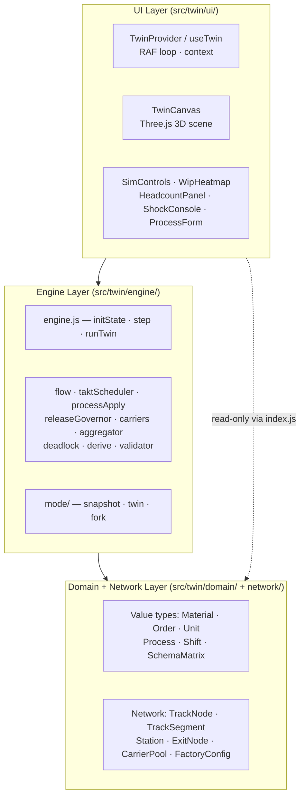

# Code Structure

Annotated file tree. Start here when navigating the codebase cold.

---

## Architectural Layers

The codebase is split into three strict layers. The import rule is one-way: lower layers never import upper ones. `layerPurity.test.js` enforces this for the engine.



**Rule:** `src/twin/engine/` imports only `domain/`, `network/`, and `util/`. It never imports React, DOM, or any UI module.

---

## Root

```
index.html              HTML entry point (Vite)
vite.config.js          Build config (React plugin, Vitest jsdom env)
playwright.config.js    E2E test runner config
vercel.json             Vercel deployment hint
package.json            Dependencies and npm scripts
```

---

## `src/` — Application Source

### Entry

```
src/main.jsx            Routes to TwinApp (default, /) or legacy App (/legacy)
src/index.css           Global styles (~12 KB)
```

### `src/twin/` — Deterministic Engine (actively developed)

This is the heart of the application. Engine phases 0–C are complete (200+ tests green); UI Phase D is in progress.

```
src/twin/ui/
  TwinApp.jsx           Main shell: toolbar, canvas, side panels, sim controls
  TwinProvider.jsx      React context; drives the RAF animation loop
  TwinCanvas.jsx        Three.js <Canvas> + scene composition
  SimControls.jsx       Play / pause / step / speed / rewind strip
  ConfigPanel.jsx       Left dock: orders, shifts, processes (editable)
  WipHeatmap.jsx        Right rail: buffer-fullness colour map
  HeadcountPanel.jsx    Live headcount and staffing metrics
  ShockConsole.jsx      Scenario injection (machine failures, stoppages)
  ProcessForm.jsx       Inline takt-time editor (pause-and-apply)
  FixtureSelector.jsx   Load pre-built configs (linearLine, assemblyLine, carrierLine)
  TrackEditor.jsx       Network topology editor (nodes + segments)
  CarrierPoolPanel.jsx  Carrier fleet configuration
  CarrierAgents.jsx     3D visualisation of carrier state
  SchemaMatrixPanel.jsx External-system impact inspector (SAP / MES / WMS / Noviga)
  UnitStream.jsx        Real-time unit event stream
  TwinAtmosphere.jsx    3D scene lighting
  TrackSegmentLines.jsx Draws conveyor lines in the 3D scene
  useTwin.js            React hook: advanceFrame, pause, rewind, speed multiplier
  twinLayout.js         Panel docking and resize logic
  configDraft.js        Config editor state machine (toDraft / buildConfig)
  kit.jsx               Shared UI primitives (Button, Text, colour constants)

src/twin/engine/
  engine.js             Event-loop kernel: initState(), step(), runTwin()
  clock.js              Discrete time management
  flow.js               Unit movement physics (segments, backpressure, arrivals)
  taktScheduler.js      Slot-based scheduling (parallel slots, takt times)
  processApply.js       Applies process logic (transform, assembly, inspect, hold …)
  releaseGovernor.js    WIP cap; gates unit release into the network
  carriers.js           Carrier pool round-trip physics; shift gating
  aggregator.js         Order completion counters; live metrics
  deadlock.js           Circular-wait detection
  derive.js             Derived formulas (slots, throughput, round-trip time)
  validator.js          Config validation (references, connectivity, reachability)
  events.js             Event type constants
  mode/
    snapshot.js         State checkpoint for rewind
    twin.js             Standard simulation mode
    fork.js             What-if branching (copy-on-write isolation)

src/twin/domain/
  material.js           makeMaterial — physical item type + allowed-process list
  process.js            makeProcess — manufacturing step (transform, assembly …)
  order.js              makeOrder — production request
  unit.js               Unit lifecycle (pending → track → station → exit)
  shift.js              makeShift — operating hours window
  schemaMatrix.js       makeSchemaMatrix — external system CRUD impact docs

src/twin/network/
  factoryConfig.js      makeFactoryConfig — bundles + validates full spec
  station.js            makeStation — workstation with processes + buffer capacity
  trackNode.js          makeTrackNode — network node (INTAKE, JUNCTION, STATION_INPUT …)
  trackSegment.js       makeTrackSegment — conveyor or carrier link
  exitNode.js           makeExitNode — terminal node (SHIP or SCRAP)
  carrierPool.js        makeCarrierPool — vehicle fleet definition

src/twin/fixtures/
  linearLine.js         Full M800 value stream (Supplier → IQC → SMT → … → Customer)
  assemblyLine.js       Multi-BOM assembly scenario
  carrierLine.js        Carrier-driven logistics network

src/twin/util/
  ids.js                Deterministic ID generation
  rng.js                Seedable RNG (ensures reproducible stochastic outcomes)
  assert.js             Invariant assertions used throughout the engine
```

### `src/components/` and `src/scene/` — Legacy 3D Prototype (reference only)

```
src/components/
  FactoryTwin.jsx       Main 3D canvas for the legacy M800 scene
  LayoutEditor.jsx      Drag-and-drop station repositioning
  AssetInspector.jsx    Gallery modal for inspecting individual machine models

src/scene/
  MachineMeshes.jsx     17+ machine 3D models (cuboid primitives)
  LocationNode.jsx      Renders each station at its world coordinate
  BuildingShells.jsx    KMP and WH building shells, floors, columns
  FloorPaths.jsx        Conveyor belt path lines
  ParticleStream.jsx    Animated particles showing material flow
  PathRouter.js         Pathfinding (same-floor, cross-floor, cross-site)
  ModelRegistry.js      Machine type → 3D model mapping
  SceneAtmosphere.jsx   Lighting, shadows, ambient setup
  ScenePostFX.jsx       Post-processing (bloom)
  SetDressing.jsx       Signs, labels, decorative elements
```

### `src/data/` — Static Baseline Data

```
src/data/m800_model.js          Hardcoded M800 factory network
                                 (51 locations, 19 stations, 26 materials, 27 processes)
                                 Used by the legacy prototype only.
src/data/transport_topology.js  Network topology definitions (legacy)
```

### `src/engine/` and `src/hooks/` — Legacy Simulation (reference only)

```
src/engine/useSimEngine.js      Legacy simulation hook (scenarios, KPIs, timeline)
src/hooks/usePullEngine.js      Pull engine driving the legacy 3D prototype
```

### `src/materials/` and `src/layout/`

```
src/materials/factoryMaterials.js   Three.js material definitions (colour palette, textures)
src/layout/autoLayout.js            Auto-layout algorithm for positioning nodes
```

---

## `api/` — Backend (Vercel Serverless)

```
api/config.js       GET /api/config  → load saved FactoryConfig from Neon Postgres
                    POST /api/config → upsert FactoryConfig (auto-save, 600 ms debounce)
```

Table created on first request: `factory_configs(id TEXT PK, config JSONB, updated_at TIMESTAMPTZ)`.

---

## `tests/` — End-to-End Tests

```
tests/twin.spec.js      Golden path: canvas renders, sim-time advances, speed ×100,
                         pause-and-apply takt edit, zero shocks
tests/factory.spec.js   Additional scenario coverage
```

---

## `docs/`

```
docs/ARCHITECTURE.md                        Engine design and data flow (this repo)
docs/CODE_STRUCTURE.md                      This file
docs/TESTING.md                             How to run and extend tests
docs/factory-config-guide.md                How to model a factory (data → code)
docs/designs/factory-twin-v2-architecture.md  Authoritative full design doc
docs/designs/factory-pull-digital-twin.md   SUPERSEDED — v1 CEO plan
docs/superpowers/plans/                     Tactical phase implementation plans
```
